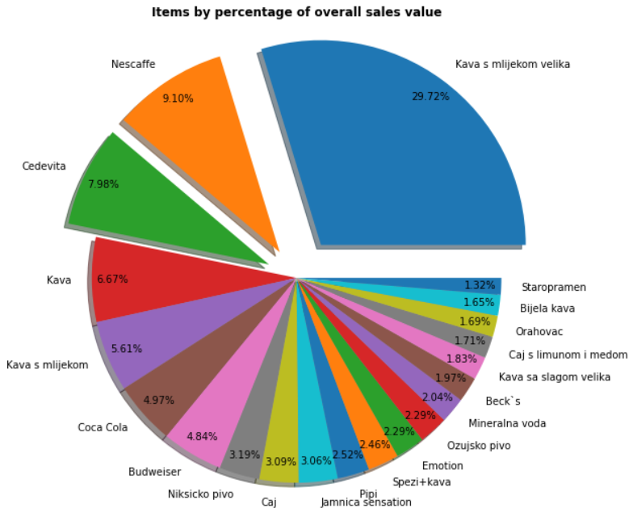
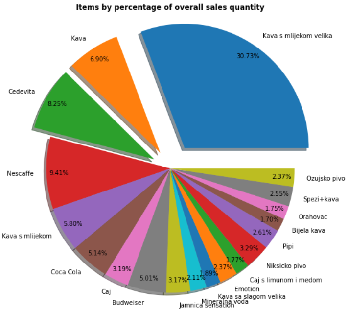
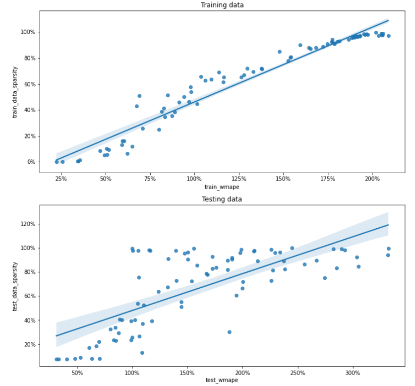

caffe_bar_sales_analysis
==============================

Project for figuring out the possible ways in which machine learning can benefit the drinks retail sales.

Initial dataset is generated with src/data/make_dataset.py script. 

### Items by sales value and quantity

Following pie charts offer visualisation of most important items from dataset by overall sales value and
overall sales quantity.

### Dataset coverage

Judging by coverage in days, different approaches should be taken into consideration when creating ML models,
such as custom time series split. Also significant number of items which stopped selling can be observed in countplot.

### Items filtering and modelling process

Because of low amounts of data for a large number of items, filtering is required to get models for items 
which would actually generate useful predictions. With regards to a way of filtering, plenty of different methods can be applied.
Initially in this example filtering is done with regards to the way in which data will be split.
First date of test set is used so that if there is data before and after that date, means that there is data available for a model to train and test on.
If the item fulfills this condition, model is built for it. 
Predictors used in this example contain information about day of week, month of year, thirds of a month, year, some holidays (Christmas, New Year's, Easter). 

Data preparation, model selection and evaluation steps are:
1. Fill time series data for an item in a way that dates with no sales (between first and last valid sales dates) are added and sales is set to zero
2. Filled dataset is split into training and test dataset with test_set_first_date
3. Training data is further split into training and validation set (function time_series_cv(...))
3. Pipeline for feature generation and estimator fitting is assembled
4. GridSearchCV fit is done
5. Features coefficients, predictions and errors are calculated

Total number of items left was 88.
First glimpse at scores shows significant relationship between data sparsity and error metric. 
Outliers on the high end of scores were removed for better visualisation (5/88 removed).

Scores distribution per dataset can be observed in the following boxplot (with removed outliers WMAPE < 500).
Greater errors and their deviation can be observed in the upper boxplot (WMAPE) while in the lower boxplot of Weighted Bias error metric 
positive bias can be observed which indicates overshooting forecast.

Project Organization
------------

    ├── LICENSE
    ├── Makefile           <- Makefile with commands like `make data` or `make train`
    ├── README.md          <- The top-level README for developers using this project.
    ├── data
    │   ├── external       <- Data from third party sources.
    │   ├── interim        <- Intermediate data that has been transformed.
    │   ├── processed      <- The final, canonical data sets for modeling.
    │   └── raw            <- The original, immutable data dump.
    │
    ├── docs               <- A default Sphinx project; see sphinx-doc.org for details
    │
    ├── models             <- Trained and serialized models, model predictions, or model summaries
    │
    ├── notebooks          <- Jupyter notebooks. Naming convention is a number (for ordering),
    │                         the creator's initials, and a short `-` delimited description, e.g.
    │                         `1.0-jqp-initial-data-exploration`.
    │
    ├── references         <- Data dictionaries, manuals, and all other explanatory materials.
    │
    ├── reports            <- Generated analysis as HTML, PDF, LaTeX, etc.
    │   └── figures        <- Generated graphics and figures to be used in reporting
    │
    ├── requirements.txt   <- The requirements file for reproducing the analysis environment, e.g.
    │                         generated with `pip freeze > requirements.txt`
    │
    ├── setup.py           <- makes project pip installable (pip install -e .) so src can be imported
    ├── src                <- Source code for use in this project.
    │   ├── __init__.py    <- Makes src a Python module
    │   │
    │   ├── data           <- Scripts to download or generate data
    │   │   └── make_dataset.py
    │   │
    │   ├── features       <- Scripts to turn raw data into features for modeling
    │   │   └── build_features.py
    │   │
    │   ├── models         <- Scripts to train models and then use trained models to make
    │   │   │                 predictions
    │   │   ├── predict_model.py
    │   │   └── train_model.py
    │   │
    │   └── visualization  <- Scripts to create exploratory and results oriented visualizations
    │       └── visualize.py
    │
    └── tox.ini            <- tox file with settings for running tox; see tox.readthedocs.io

--------

<small>Project based on the <a target="_blank" href="https://drivendata.github.io/cookiecutter-data-science/">cookiecutter data science project template</a>. #cookiecutterdatascience</small>

